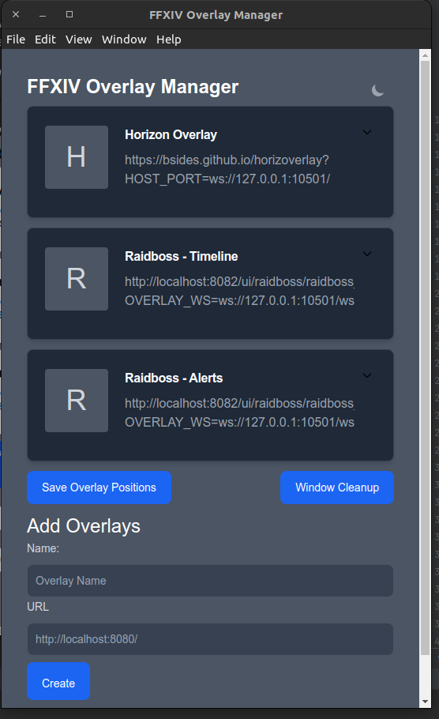

# FFXIV Electron Based Overlay Manager

The other solutions weren't working for me very well on Linux,
so I put this together really fast using 
[Electron Forge](https://github.com/electron/forge)

*This is early development.*



# Download Releases

You can download the lastest release Github [here](https://github.com/unfaiyted/ffxiv-overlay-tools/releases)


# Build It Yourself

```bash
npm run make 
```
You made need to install additional make tools. Depending on your system setup.

It'll output somewhere like this `./out/make/`

```bash
apt install ./out/make/deb/x64/ffxiv-overlay-tools_1.0.1_am64.deb
```
*Path may differ depending on version built and os configuration*


# Development Setup
```bash
npm install
npm start  # begins development server/client
```

I've only tested it in Ubuntu 22.04, but is a standard Electron-built app, so it should build on most systems.


## TODO:
- Automate GitHub actions to build it?
- implement the handlers used by the other overlay tools
  - Right now, I'm not able to do certain things like editing the settings in an overlay.
   - https://overlayplugin.github.io/OverlayPlugin/devs/