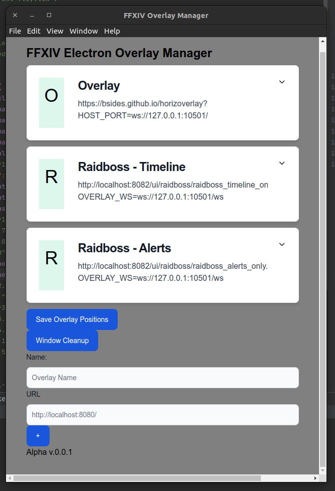

# FFXIV Electron Based Overlay Manager

The other solutions werent working for me very well on linux so I put this together really fast using 
[Electron Forge](https://github.com/electron/forge)

This is really early development.



# Build

```bash
npm package
```

It'll output somewhere like this `./out/ffxiv-overlay-tools-linux-x64/`

```bash
./ffxiv-overlay-tools
```


# Development Setup
```bash
npm install
npm start  # begins development server/client
```

I've only tested it in Ubuntu 22.04, but is a standard Electron built app so it should build on most systems.


## TODO:
- Automate github actions to build it?
- 

